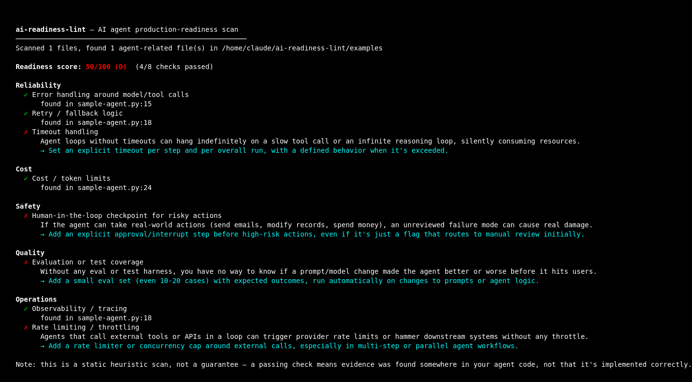

# ai-readiness-lint

**ESLint for AI agents.** Is your agent actually ready for production, or is
it a demo wearing a production costume?



Point it at a repo and it scans
your agent/orchestration code (LangGraph, CrewAI, LangChain, AutoGen, Bedrock
AgentCore) for the guardrails that separate a demo from something you'd
actually ship: error handling, cost limits, human-in-the-loop checkpoints,
evaluation coverage, retries, timeouts, observability, and rate limiting.

It outputs a Lighthouse-style score (0–100, graded A–F) with evidence for
what it found and concrete suggestions for what's missing, as shown above.

## Add the badge to your README

```bash
npx ai-readiness-lint . --badge
```

```md

```

Every repo that adds the badge is a free ad for the tool that scored it —
that's the whole growth model.

## We scanned 5 well-known open-source agent projects

Real scores, run with the version of this tool in this repo, no cherry-picking:

| Repo | Score | Grade | Agent files scanned |
|---|---|---|---|
| [Significant-Gravitas/AutoGPT](https://github.com/Significant-Gravitas/AutoGPT) | 100/100 | A | 181 |
| [microsoft/autogen](https://github.com/microsoft/autogen) | 88/100 | B | 374 |
| [crewAIInc/crewAI-examples](https://github.com/crewAIInc/crewAI-examples) | 75/100 | B | 68 |
| [langchain-ai/langgraph-example](https://github.com/langchain-ai/langgraph-example) | 0/100 | F | 4 |
| [langchain-ai/react-agent](https://github.com/langchain-ai/react-agent) | 0/100 | F | 4 |

The pattern is the interesting part: **mature, widely-deployed frameworks
score well; official quickstart templates score at the bottom.** That's not
a knock on the templates — they're intentionally minimal so beginners aren't
overwhelmed. It's the actual risk: teams copy a quickstart template into
production and inherit its zero guardrails without realizing the template
was never meant to ship as-is.

Run it on your own repo and see where you land — then open a PR if you think
a check is wrong or missing.

## Why this exists

Most AI agent tooling focuses on making agents easier to *build*. Very
little focuses on whether an agent is actually ready to *run in production*
— the same questions any experienced delivery/engineering lead asks before
sign-off: what happens when this fails? what does it cost if it loops? who
reviews it before it takes a risky action? This tool turns those questions
into a repeatable, automatable check.

## Install & usage

No installation needed — run it directly:

```bash
npx ai-readiness-lint .
```

Or point it at a specific project:

```bash
npx ai-readiness-lint ./path/to/your-agent
```

Machine-readable output for CI pipelines:

```bash
npx ai-readiness-lint . --json > readiness-report.json
```

The CLI exits with a non-zero status code when the score is below 60, so it
can gate a CI pipeline if you want it to.

## What it checks

| Category | Check |
|---|---|
| Reliability | Error handling around model/tool calls |
| Reliability | Retry / fallback logic |
| Reliability | Timeout handling |
| Cost | Cost / token limits |
| Safety | Human-in-the-loop checkpoint for risky actions |
| Quality | Evaluation or test coverage |
| Operations | Observability / tracing |
| Operations | Rate limiting / throttling |

Full details and reasoning for each check are in
[`src/checks.js`](./src/checks.js).

## How it works (and its limits)

This is a **static, heuristic scan** — it looks for regex signals in your
code (e.g. `try/except`, `max_tokens`, `require_approval`, `langfuse`) across
files that look like agent code. It does not execute your agent or call any
LLM API, so it's free and safe to run anywhere, including CI.

That also means it can be fooled: a `try/except` that swallows every error
silently still "passes" the error-handling check. Treat a green check as
"evidence this was considered," not "this is definitely correct." The real
value is in what it catches by omission — an agent that can issue refunds
with no approval step and no eval harness is a good thing to know about
before a client finds out the hard way.

Agent detection currently looks for LangGraph, CrewAI, LangChain, AutoGen,
and Bedrock AgentCore signals. If your framework isn't recognized, the tool
will say so rather than silently returning a meaningless score — please open
an issue or PR with the framework's import signature.

## Roadmap

- [ ] GitHub Action that posts the report as a PR comment
- [ ] Config file (`.airlintrc`) to add custom checks or exclude paths
- [ ] Support for more frameworks (Semantic Kernel, Vercel AI SDK, OpenAI
      Assistants API)
- [ ] Per-file (not just repo-level) scoring

## Contributing

Issues and PRs welcome — especially new checks, framework signals, and false
positive/negative reports against real agent codebases. See
[CONTRIBUTING.md](./CONTRIBUTING.md) for how to get started.

## License

MIT
